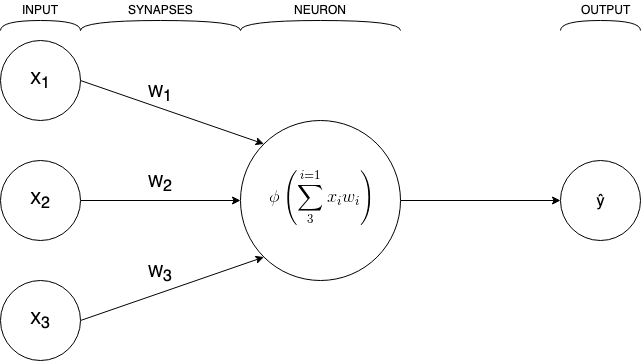

<h1>Problem set</h1>
Below you can see four sets of inputs where we feed a training model three digits and declare the expected output. Based on this, we want to write a neural network that can predict the output of the 'New situation' input.
<h2>Previously known inputs and outputs</h2>
<table>
<tr>
  <td>
  </td>
  <td colspan="3">
  Input
  </td>
  <td>
  Output
  </td>
</tr>
<tr>
  <td>
  Example 1
  </td>
  <td>
  0
  </td>
  <td>
  0
  </td>
  <td>
  1
  </td>
  <td>
  0
  </td>
</tr>
<tr>
  <td>
  Example 2
  </td>
  <td>
  1
  </td>
  <td>
  1
  </td>
  <td>
  1
  </td>
  <td>
  1
  </td>
</tr>
<tr>
  <td>
  Example 3
  </td>
  <td>
  1
  </td>
  <td>
  0
  </td>
  <td>
  1
  </td>
  <td>
  1
  </td>
</tr>
<tr>
  <td>
  Example 4
  </td>
  <td>
  0
  </td>
  <td>
  1
  </td>
  <td>
  1
  </td>
  <td>
  0
  </td>
</tr>
</table>
<h2>New situation</h2>
<table>
<tr>
  <td>
  </td>
  <td colspan="3">
  Input
  </td>
  <td>
  Output
  </td>
</tr>
<tr>
  <td>
  New input
  </td>
  <td>
  1
  </td>
  <td>
  0
  </td>
  <td>
  0
  </td>
  <td>
  ?
  </td>
</tr>
</table>

<h1>Perceptron neural network</h1>

This network won't have any hidden layers and will look like this:

The input values will in our case be either 0 or 1. Each synapse will be given a random weight. After passing through the neuron which will do a weighted sum of the inputs. We will then put it through a normalizing function to get the output to either a 0 or a 1.

