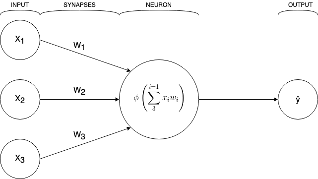
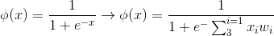
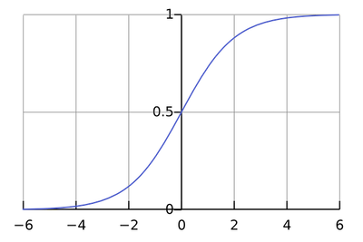

<h1>Problem set</h1>
Below you can see four sets of inputs where we feed a training model three digits and declare the expected output. Based on this, we want to write a neural network that can predict the output of the 'New situation' input.

<h2>Previously known inputs and outputs</h2>
<table>
<tr>
  <td>
  </td>
  <td colspan="3">
  Input
  </td>
  <td>
  Output
  </td>
</tr>
<tr>
  <td>
  Example 1
  </td>
  <td>
  0
  </td>
  <td>
  0
  </td>
  <td>
  1
  </td>
  <td>
  0
  </td>
</tr>
<tr>
  <td>
  Example 2
  </td>
  <td>
  1
  </td>
  <td>
  1
  </td>
  <td>
  1
  </td>
  <td>
  1
  </td>
</tr>
<tr>
  <td>
  Example 3
  </td>
  <td>
  1
  </td>
  <td>
  0
  </td>
  <td>
  1
  </td>
  <td>
  1
  </td>
</tr>
<tr>
  <td>
  Example 4
  </td>
  <td>
  0
  </td>
  <td>
  1
  </td>
  <td>
  1
  </td>
  <td>
  0
  </td>
</tr>
</table>
<h2>New situation</h2>
<table>
<tr>
  <td>
  </td>
  <td colspan="3">
  Input
  </td>
  <td>
  Output
  </td>
</tr>
<tr>
  <td>
  New input
  </td>
  <td>
  1
  </td>
  <td>
  0
  </td>
  <td>
  0
  </td>
  <td>
  ?
  </td>
</tr>
</table>

<h1>Perceptron neural network</h1>

This network won't have any hidden layers and will look like this:

The input values will in our case be either 0 or 1. Each synapse will be given a random weight. After passing through the neuron which will do a weighted sum of the inputs we'll put it through a normalizing function to get the output to either a 0 or a 1. For this, we'll use the Sigmoid normalizing function.

<h1>Training process</h1>
<ol>
    <li>Take the input from the training example and put them through the formula to get the neurons output</li>
    <li>Calculate the error, which is the difference between the output we got and the actual output</li>
    <li>Depending on the severity of the error, adjust the weights accordingly</li>
    <li>Repeat the process 100000 times</li>
</ol>
<h2>Error Weighted Derivative</h2>

We'll multiple the error, which is the difference between the expected output and the actual output, with the input - which is either a 0 or a 1. Then we take the gradient of the Sigmoid function at our output.

